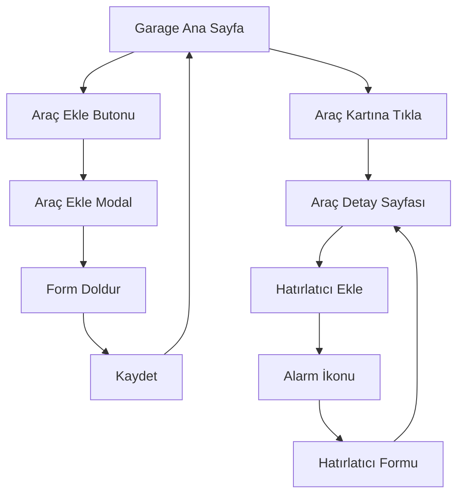

## 1. Product Overview
Araç sahiplerinin araçlarını yönetebileceği garage uygulaması. Kullanıcılar araç ekleyebilir, mevcut araçlarını listeleyebilir ve her araç için detaylı bilgilere ulaşabilir. Ayrıca araçlar için hatırlatıcılar (vize, bakım) oluşturabilir.

Kullanıcılar: Araç sahipleri, filo yöneticileri, bireysel araç kullanıcıları.

## 2. Core Features

### 2.1 User Roles
| Role | Registration Method | Core Permissions |
|------|---------------------|------------------|
| Normal User | Email/Kayıt Ol | Araç ekleme, listeleme, detay görüntüleme, hatırlatıcı oluşturma |

### 2.2 Feature Module
Garage uygulaması aşağıdaki ana sayfalardan oluşur:
1. **Garage Ana Sayfa**: Araç listesi, araç ekleme butonu
2. **Araç Detay Sayfası**: Araç bilgileri, son işlemler, hatırlatıcılar

### 2.3 Page Details
| Page Name | Module Name | Feature description |
|-----------|-------------|---------------------|
| Garage Ana Sayfa | Araç Listesi | FlatList ile tüm araçların kart görünümünde listelenmesi. Her kart marka, model ve plaka bilgisini gösterir. |
| Garage Ana Sayfa | Araç Ekle Butonu | Sağ alt köşede artı (+) butonu. Butona tıklayınca araç ekleme modalı açılır. |
| Garage Ana Sayfa | Araç Ekle Modal | Marka, model, yıl ve plaka alanlarının bulunduğu form. Kaydet butonu ile yeni araç eklenir. |
| Araç Detay Sayfası | Araç Bilgileri | Marka, model, yıl, plaka ve ek bilgilerin detaylı görüntülenmesi. |
| Araç Detay Sayfası | Son İşlemler | Araçla ilgili son yapılan işlemlerin kronolojik sırayla listelenmesi. |
| Araç Detay Sayfası | Hatırlatıcılar | Alarm ikonu ile hatırlatıcı ekleme özelliği. Vize, bakım gibi tarih bazlı hatırlatıcılar oluşturulabilir. |

## 3. Core Process
Kullanıcı Flow'u:
1. Kullanıcı garage ana sayfasını açar
2. Mevcut araçlar FlatList ile görüntülenir
3. Araç eklemek için artı butonuna tıklar
4. Modal açılır, marka/model/yıl/plaka bilgileri girilir
5. Kaydet butonuna basılır, araç listeye eklenir
6. Herhangi bir araç kartına tıklanır
7. Araç detay sayfası açılır
8. Araç bilgileri görüntülenir
9. Alarm ikonuna tıklanarak hatırlatıcı eklenir

## 4. User Interface Design

### 4.1 Design Style
- Primary Color: #2563eb (Mavi)
- Secondary Color: #64748b (Gri)
- Background: #ffffff (Beyaz)
- Card Background: #f8fafc (Açık gri)
- Button Style: Yuvarlak köşeler, gölge efekti
- Font: System font (iOS: SF Pro, Android: Roboto)
- Font Sizes: Başlık 18px, İçerik 14px, Küçük metin 12px
- Layout: Card-based liste görünümü
- İkonlar: Material Design ikon seti

### 4.2 Page Design Overview
| Page Name | Module Name | UI Elements |
|-----------|-------------|-------------|
| Garage Ana Sayfa | Araç Listesi | Card-based layout, her kart yatay düzen, marka/model büyük yazı, plaka küçük yazı, kart aralarında 8px boşluk |
| Garage Ana Sayfa | Araç Ekle Butonu | Sağ alt köşede dairesel FAB butonu, artı ikonu, mavi arka plan |
| Garage Ana Sayfa | Araç Ekle Modal | Yarım ekran modal, form alanları arasında 16px boşluk, kaydet butonu tam genişlik |
| Araç Detay Sayfası | Araç Bilgileri | Üstte araç fotoğrafı yer tutucu, altında bilgi kartları, grid layout |
| Araç Detay Sayfası | Son İşlemler | Timeline görünümü, her işlem için tarih ve açıklama |
| Araç Detay Sayfası | Hatırlatıcılar | Üstte alarm ikonu, tıklanınca alt sayfa açılır |

### 4.3 Responsiveness
- Mobile-first tasarım
- iOS ve Android uyumlu
- Touch interaction optimize edilmiş
- Farklı ekran boyutlarına uyumlu (responsive)