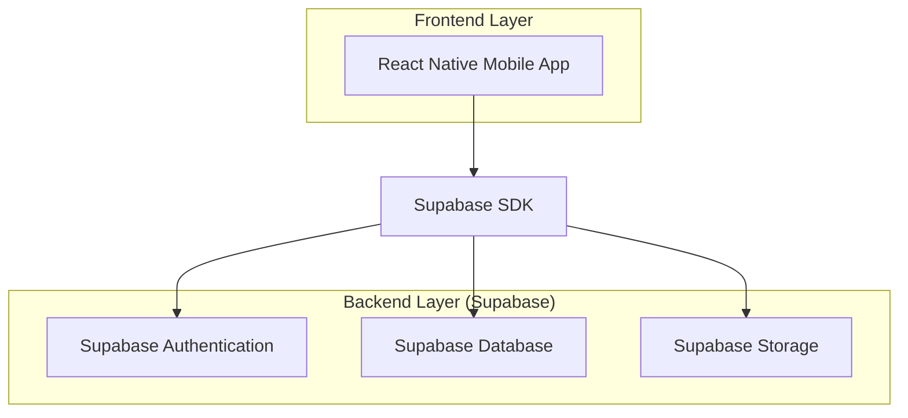
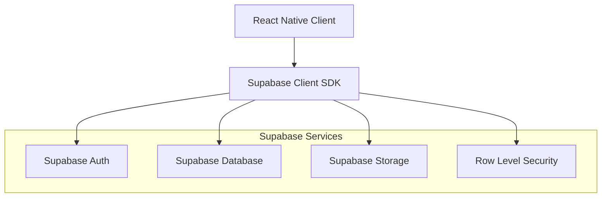
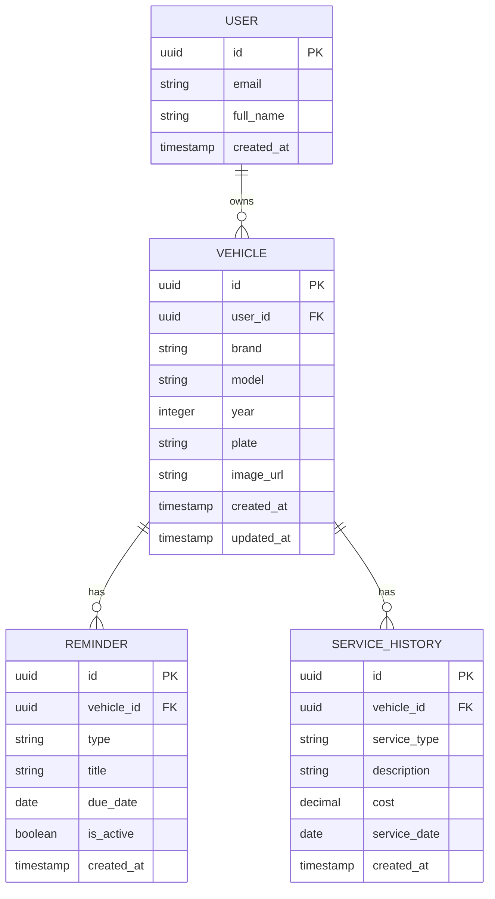

## 1. Architecture design



## 2. Technology Description
- Frontend: React Native@0.72 + TypeScript + Expo
- State Management: React Context API + useState
- Backend: Supabase (BaaS)
- Database: PostgreSQL (via Supabase)
- Authentication: Supabase Auth
- Storage: Supabase Storage (araç fotoğrafları için)

## 3. Route definitions
| Route | Purpose |
|-------|---------|
| /garage | Garage ana sayfası, araç listesi |
| /garage/add | Araç ekleme modalı |
| /garage/[id] | Araç detay sayfası |
| /garage/[id]/reminders | Hatırlatıcılar sayfası |

## 4. API definitions

### 4.1 Araç Yönetimi API'leri

Araç listesini getir
```
GET /api/vehicles
```

Request Headers:
| Header | Value | Description |
|--------|-------|-------------|
| Authorization | Bearer [token] | Supabase auth token |

Response:
```json
{
  "vehicles": [
    {
      "id": "uuid",
      "brand": "Toyota",
      "model": "Corolla",
      "year": 2020,
      "plate": "34ABC123",
      "created_at": "2024-01-01T00:00:00Z"
    }
  ]
}
```

Yeni araç ekle
```
POST /api/vehicles
```

Request:
| Param Name | Param Type | isRequired | Description |
|------------|------------|-------------|-------------|
| brand | string | true | Araç markası |
| model | string | true | Araç modeli |
| year | number | true | Üretim yılı |
| plate | string | true | Plaka numarası |

Response:
```json
{
  "id": "uuid",
  "brand": "Toyota",
  "model": "Corolla",
  "year": 2020,
  "plate": "34ABC123"
}
```

### 4.2 Hatırlatıcı API'leri

Hatırlatıcıları getir
```
GET /api/vehicles/[id]/reminders
```

Response:
```json
{
  "reminders": [
    {
      "id": "uuid",
      "vehicle_id": "uuid",
      "type": "insurance",
      "title": "Sigorta Vizesi",
      "due_date": "2024-12-31",
      "is_active": true
    }
  ]
}
```

Yeni hatırlatıcı ekle
```
POST /api/reminders
```

Request:
| Param Name | Param Type | isRequired | Description |
|------------|------------|-------------|-------------|
| vehicle_id | string | true | Araç ID |
| type | string | true | reminder tipi (insurance, maintenance) |
| title | string | true | Hatırlatıcı başlığı |
| due_date | string | true | Bitiş tarihi |

## 5. Server architecture diagram



## 6. Data model

### 6.1 Data model definition



### 6.2 Data Definition Language

Kullanıcı tablosu (users)
```sql
-- create table
CREATE TABLE users (
    id UUID PRIMARY KEY DEFAULT gen_random_uuid(),
    email VARCHAR(255) UNIQUE NOT NULL,
    full_name VARCHAR(255) NOT NULL,
    created_at TIMESTAMP WITH TIME ZONE DEFAULT NOW()
);

-- grant permissions
GRANT SELECT ON users TO anon;
GRANT ALL PRIVILEGES ON users TO authenticated;
```

Araç tablosu (vehicles)
```sql
-- create table
CREATE TABLE vehicles (
    id UUID PRIMARY KEY DEFAULT gen_random_uuid(),
    user_id UUID REFERENCES auth.users(id) ON DELETE CASCADE,
    brand VARCHAR(100) NOT NULL,
    model VARCHAR(100) NOT NULL,
    year INTEGER NOT NULL CHECK (year >= 1900 AND year <= EXTRACT(YEAR FROM NOW()) + 1),
    plate VARCHAR(20) NOT NULL,
    image_url TEXT,
    created_at TIMESTAMP WITH TIME ZONE DEFAULT NOW(),
    updated_at TIMESTAMP WITH TIME ZONE DEFAULT NOW()
);

-- create indexes
CREATE INDEX idx_vehicles_user_id ON vehicles(user_id);
CREATE INDEX idx_vehicles_created_at ON vehicles(created_at DESC);

-- grant permissions
GRANT SELECT ON vehicles TO anon;
GRANT ALL PRIVILEGES ON vehicles TO authenticated;

-- RLS policy
ALTER TABLE vehicles ENABLE ROW LEVEL SECURITY;
CREATE POLICY "Users can view own vehicles" ON vehicles FOR SELECT USING (auth.uid() = user_id);
CREATE POLICY "Users can insert own vehicles" ON vehicles FOR INSERT WITH CHECK (auth.uid() = user_id);
CREATE POLICY "Users can update own vehicles" ON vehicles FOR UPDATE USING (auth.uid() = user_id);
CREATE POLICY "Users can delete own vehicles" ON vehicles FOR DELETE USING (auth.uid() = user_id);
```

Hatırlatıcı tablosu (reminders)
```sql
-- create table
CREATE TABLE reminders (
    id UUID PRIMARY KEY DEFAULT gen_random_uuid(),
    vehicle_id UUID REFERENCES vehicles(id) ON DELETE CASCADE,
    type VARCHAR(50) NOT NULL CHECK (type IN ('insurance', 'maintenance', 'tax', 'inspection')),
    title VARCHAR(255) NOT NULL,
    due_date DATE NOT NULL,
    is_active BOOLEAN DEFAULT true,
    created_at TIMESTAMP WITH TIME ZONE DEFAULT NOW()
);

-- create indexes
CREATE INDEX idx_reminders_vehicle_id ON reminders(vehicle_id);
CREATE INDEX idx_reminders_due_date ON reminders(due_date);

-- grant permissions
GRANT SELECT ON reminders TO anon;
GRANT ALL PRIVILEGES ON reminders TO authenticated;

-- RLS policy
ALTER TABLE reminders ENABLE ROW LEVEL SECURITY;
CREATE POLICY "Users can view own reminders" ON reminders FOR SELECT USING (EXISTS (
    SELECT 1 FROM vehicles WHERE vehicles.id = reminders.vehicle_id AND vehicles.user_id = auth.uid()
));
CREATE POLICY "Users can insert own reminders" ON reminders FOR INSERT WITH CHECK (EXISTS (
    SELECT 1 FROM vehicles WHERE vehicles.id = reminders.vehicle_id AND vehicles.user_id = auth.uid()
));
```

Servis geçmişi tablosu (service_history)
```sql
-- create table
CREATE TABLE service_history (
    id UUID PRIMARY KEY DEFAULT gen_random_uuid(),
    vehicle_id UUID REFERENCES vehicles(id) ON DELETE CASCADE,
    service_type VARCHAR(100) NOT NULL,
    description TEXT,
    cost DECIMAL(10,2),
    service_date DATE NOT NULL,
    created_at TIMESTAMP WITH TIME ZONE DEFAULT NOW()
);

-- create indexes
CREATE INDEX idx_service_history_vehicle_id ON service_history(vehicle_id);
CREATE INDEX idx_service_history_service_date ON service_history(service_date DESC);

-- grant permissions
GRANT SELECT ON service_history TO anon;
GRANT ALL PRIVILEGES ON service_history TO authenticated;

-- RLS policy
ALTER TABLE service_history ENABLE ROW LEVEL SECURITY;
CREATE POLICY "Users can view own service history" ON service_history FOR SELECT USING (EXISTS (
    SELECT 1 FROM vehicles WHERE vehicles.id = service_history.vehicle_id AND vehicles.user_id = auth.uid()
));
```